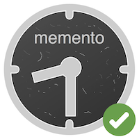

# Memento Validator
 
 
Memento validator toolkit lets you validate your memento implementation.

## 1. HTTP API

You can either host the web API locally (for testing local URIs), or can use 
the LANL hosted instance at `http://labs.mementoweb.org/validator/api`.

### API Specification

**[GET] /api**

| Parameter     |  Description | Example  |
|---            |---|---|
| uri           | URI of the resource  | ```https://arquivo.pt/wayback/20080215125110/http://www.facebook.com/``` |
| datetime      | Date and time for validating resource | ```Sun, 01 Apr 2010 12:00:00 GMT```  |
| type          | Type of the resource to validate   | ```timegate``` or ```memento``` or ```timemap``` or ```original```|
| followLinks   | Flag for follow-up tests. Default ```False``` | ```True``` or ```False``` |

Example: 

```shell
curl 'http://labs.mementoweb.org/validator/api?datetime=Sun,%2001%20Apr%202010%2012:00:00%20GMT&uri=http://webarchive.parliament.uk/timegate/http://animatingcardiff.wordpress.com&type=timegate&followLinks=false'
```

```json
{
  "datetime": "Sun, 01 Apr 2010 12:00:00 GMT",
  "follow": {},
  "pipeline": "mementoweb.validator.pipelines.timegate.TimeGate",
  "result": {
    "reports": [
      {
        "description": "Tests for the validity of the URI of the resource including validity and connectivity.",
        "name": "URITest",
        "source": "mementoweb.validator.tests.uri_test.URITest",
        "tests": [
          {
            "description": "",
            "name": "Valid URI",
            "result": "Pass",
            "status": 2
          }
        ]
      },
      {
        "description": "Tests for the timegate redirection. Checks for any redirection and tests for the validity",
        "name": "TimeGateBrokenRedirectTest",
        "source": "mementoweb.validator.tests.timegate_redirect_test.TimeGateBrokenRedirectTest",
        "tests": [
          {
            "description": "",
            "name": "Timegate does not return 400 for broken datetime",
            "result": "Fail",
            "status": -1
          }
        ]
      }
    ],
    "timegates": [],
    "timemaps": [
      "http://webarchive.parliament.uk/timemap/*/http://animatingcardiff.wordpress.com"
    ]
  },
  "type": "timegate",
  "uri": "http://webarchive.parliament.uk/timegate/http://animatingcardiff.wordpress.com"
}
```

### Setup Instructions

1. Install Dependencies

```shell
$ pip install -r requirements.txt
```

2. Export Flask Module (REMOVE)

```shell
$ export FLASK_APP=mementoweb/validator/web/server.py
```

3. Run Server

```shell
$ flask run
```

## 2. Web GUI
Requires [Docker](https://www.docker.com/)

```shell
docker build -t web-validator .
```

```shell
docker run -dp 9000:9000 web-validator
```

## 3. CLI Toolset

CLI tool provides easy access to mementoweb toolset.
```shell
python main.py [OPTIONS] COMMAND [ARGS]
```

### Daily validator

```shell
python main.py daily [OPTIONS]

Options:
  --env TEXT  Location of the .env configuration
  --help      Show help message and exit.
```

### Resource validator

```shell
python main.py cli [OPTIONS]

Options:
  --uri TEXT                      URI of the resource
  --type [original|memento|timemap|timegate]
                                  Type of resource
  --date TEXT                     Date Time for testing the resource
  --help                          Show help message and exit.

```

## 4. Python Library
You can use python API to run single tests, selected pipelines, extend tests, extend pipelines,
write customized tests, customized pipelines. To use Python API first install you need to install
**mementoweb** package.

1. Install with PIP
```shell
pip install https://github.com/mahanama94/memento-validator

# or

pip install path/to/package/directory
```

2. Import into your application
```python
# test.py

from mementoweb.validator.tests.uri_test import URITest

report = URITest().test(uri="http://webarchive.parliament.uk/timegate/http://animatingcardiff.wordpress.com",
                        datetime='Thu, 10 Oct 2009 12:00:00 GMT')
print(report.to_json())
```

3. Run Application
```shell
python test.py

{'name': 'URITest', 'source': 'mementoweb.validator.tests.uri_test.URITest', 'description': 'Tests for the validity of the URI of the resource including validity and connectivity', 'status': 1, 'result': 'Pass', 'tests': [{'name': 'Valid URI', 'description': '', 'status': 2, 'result': 'Pass'}]}

```

## Documentations

| | |
|--- |--- |
| API Documentation| https://github.com/mahanama94/memento-validator#1-web-api |
| Package Documentation | http://labs.mementoweb.org/validator/docs/ |
### API Documentation

### Package Documentation
Generate documentation
```shell
$ cd docs

$ sphinx-apidoc -o source ..

$ make html
```

```shell
$ firefox build/html/index.html
```

