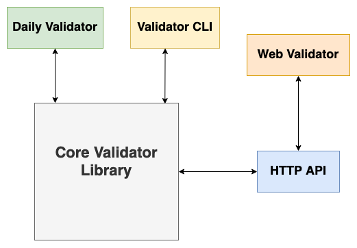

.. Mementoweb documentation master file, created by
   sphinx-quickstart on Wed Jun 30 21:00:43 2021.
   You can adapt this file completely to your liking, but it should at least
   contain the root `toctree` directive.

Welcome to Mementoweb's documentation!
======================================
The Mementoweb package/ services allows you to validate your Memento implementation.
The toolkit includes a core validator library and a selection of applications built on it.

.. toctree::
   :maxdepth: 2
   :caption: Application Guides:

   guides/http-api
   guides/web-validator
   guides/daily-validator
   guides/validator-cli

.. toctree::
   :maxdepth: 2
   :caption: Python Package:

   modules

Indices and tables
==================

* :ref:`genindex`
* :ref:`modindex`
* :ref:`search`
